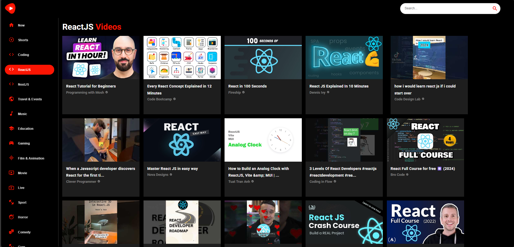

# 🎬 YouTube Clone

A fully responsive and dynamic YouTube clone built using **React**, **TypeScript**, **Material UI**, and **Axios**. This app allows users to explore videos, watch content, search, and navigate through categories — simulating a real YouTube experience.

## 🚀 Tech Stack

- **React** – Frontend library for building UIs
- **TypeScript** – Strongly typed JavaScript
- **Material UI (MUI)** – Component library for elegant, responsive design
- **Axios** – Promise-based HTTP client for API requests
- **RapidAPI / YouTube API** – Used for fetching video and channel data

---

## ✨ Features

### 🔍 Video Search
- Real-time video search with auto-refresh on input change
- Search results displayed in a grid format

### 📺 Watch Page
- Full video player with video title, channel info, and related videos
- Responsive layout for desktop and mobile

### 📂 Categories Sidebar
- Category selection for filtering videos (e.g., Music, Sports, Gaming)
- Highlighted active category

### 📱 Responsive UI
- Built with Material UI's responsive grid system
- Fully optimized for mobile, tablet, and desktop screens

### ⚡ Fast API Integration
- Axios used to fetch data from YouTube API
- Centralized API utility for easy reuse and scalability

---

## 📸 Preview

## 🚀 Live Demo

[🔗 View Live Demo](https://youtube-clone15.netlify.app)